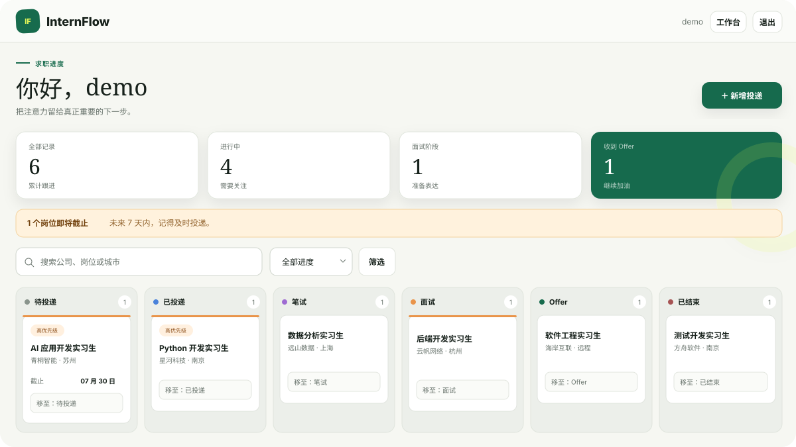

# InternFlow

[](https://github.com/IAMWHOAAA/internflow/actions/workflows/ci.yml)
[](https://www.python.org/)
[](https://www.djangoproject.com/)
[](LICENSE)

面向学生的隐私友好型实习投递管理工具。集中记录岗位、跟踪六阶段进度、
关注截止日期，并用一块清晰的看板找到下一步。



## 功能

- 注册、登录与严格的用户数据隔离
- 岗位创建、查看、编辑和删除
- 待投递、已投递、笔试、面试、Offer、已结束六阶段看板
- 关键词搜索、进度筛选和 HTMX 局部刷新
- 优先级、工作方式、地点、薪资、截止日期、JD 与个人笔记
- 状态变更历史、投递统计和 7 天内截止提醒
- SQLite 零配置开发，Docker Compose + PostgreSQL 一键运行
- 20 项自动化测试、82% 分支覆盖率、Ruff 与 GitHub Actions CI

## 为什么做它

招聘网站负责展示岗位，但学生仍要在表格、聊天收藏和日历之间手工整理
投递记录。InternFlow 提供一个可本地运行、可自行部署、围绕学生求职流程
设计的开源替代方案。

## 快速开始

需要 [uv](https://docs.astral.sh/uv/) 和 Python 3.13：

```bash
git clone https://github.com/IAMWHOAAA/internflow.git
cd internflow
cp .env.example .env
uv sync --locked --dev
uv run python manage.py migrate
uv run python manage.py seed_demo
uv run python manage.py runserver
```

打开 <http://127.0.0.1:8000>。`seed_demo` 会输出本地演示账号；不要在生产
环境使用演示密码。

也可以使用 Docker 与 PostgreSQL：

```bash
docker compose up --build
docker compose exec web python manage.py seed_demo
```

## 技术设计

InternFlow 采用 Django 模块化单体和服务端渲染。HTMX 只做渐进增强，因此
禁用 JavaScript 后，创建、编辑、删除和状态更新仍能完成。

```text
浏览器 → Django 路由 → 登录与所有权检查 → Form / ORM
                                            ↓
                                  SQLite / PostgreSQL
```

所有详情和修改查询都会同时匹配记录 ID 与当前用户；状态更新使用数据库
事务和不可变历史记录。生产镜像以非 root 用户运行，并由 WhiteNoise 提供
带内容指纹的静态文件。

## 质量检查

```bash
uv run ruff format --check .
uv run ruff check .
uv run pytest --cov
uv run python manage.py check
uv run python manage.py makemigrations --check --dry-run
```

## 文档

- [产品范围](docs/product.md)
- [架构设计](docs/architecture.md)
- [开发路线](docs/roadmap.md)
- [面试学习笔记](docs/interview-notes.md)
- [贡献指南](CONTRIBUTING.md)
- [安全策略](SECURITY.md)

## 参与贡献

欢迎提交 Issue 和 Pull Request。开始前请阅读[贡献指南](CONTRIBUTING.md)。

## License

[MIT](LICENSE)
